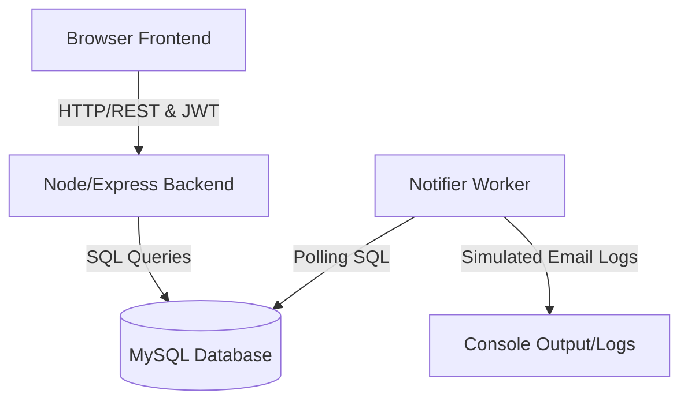

# Architecture Documentation — TaskFlow

TaskFlow is designed as a containerized, decoupled multi-service application. It separates user interface concerns, relational backend business logic, and background processing systems into three distinct running containers.

---

## 🏗️ System Overview

The following diagram illustrates how the three main services interact with each other and the shared database:

---

## 📦 Services Definition

### 1. Frontend Service (`frontend/`)
*   **Technology**: Next.js, React.
*   **Role**: Serves the user interface. Handles user input, state transitions, client-side routing, local token persistence, and HTML5 drag-and-drop actions.
*   **Configuration**: Consumes `NEXT_PUBLIC_API_URL` to route requests dynamically to the API.

### 2. Backend Service (`backend/`)
*   **Technology**: Node.js, Express, `mysql2/promise`.
*   **Role**: Handles business logic. Serves a RESTful API, verifies JWT tokens, runs schema checks, processes updates, and enforces role access controls (Admin vs. Member).
*   **Auto-Migrations**: Features automatic migration checks on startup. If MySQL takes time to boot up, the backend service retries the connection up to 10 times at 3-second intervals before exiting.

### 3. Notifier Service (`notifier/`)
*   **Technology**: Node.js.
*   **Role**: Functions as a background worker. Polls the database every 5 seconds checking for newly assigned task owners.
*   **In-Memory State**: Tracks active tasks in memory to prevent duplicate logs. When a task is assigned or reassigned, it logs a simulated email notification to the console.

---

## 🛢️ Database Layer

MySQL runs as a container and is mapped to host port `3307` (internally listening on `3306` within the container network). It utilizes a persistent volume `db_data` so that your boards, users, and tasks are saved between docker restarts.
